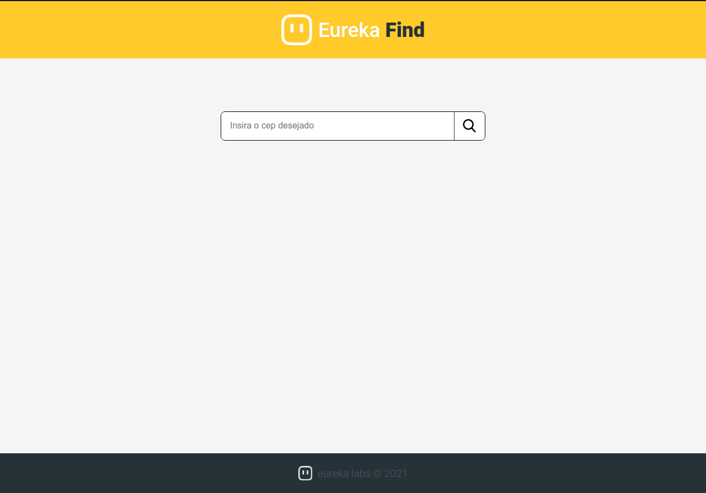
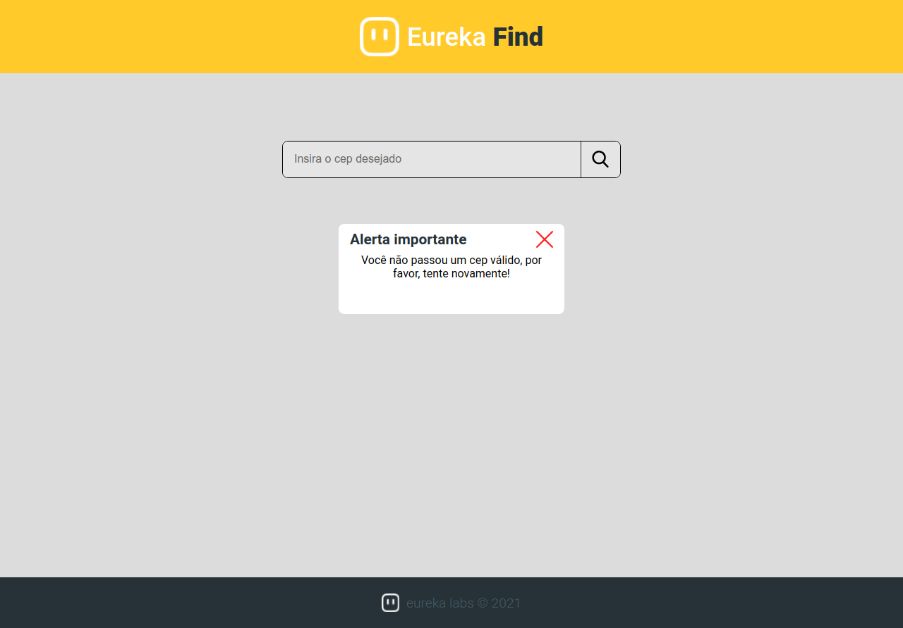
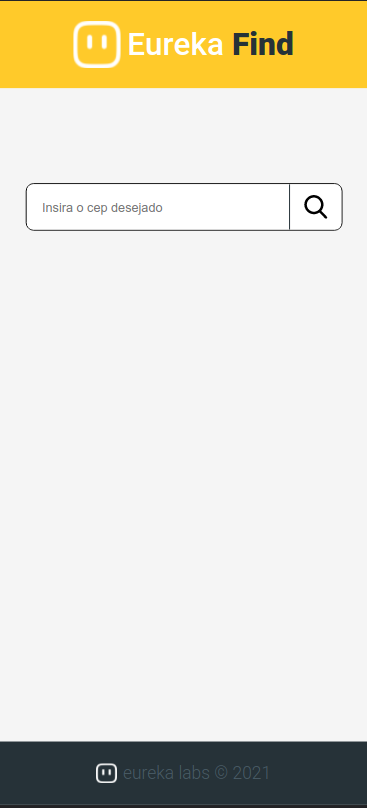

# Eureka Find - ReactJs

A **Next Level Week** é um evento da **Rocketseat** de imersão em tecnologia. Onde é uma semana de aulas com conteúdos incríveis e uma comunidade bem massa de se fazer network. Nesse evento há diversas tecnologias, esta por exemplo é a trilha de **ReactJs**.

Caso o cep estiver incompleto ou não for encontrado, será disparado este popup

Aplicação totalmente responsiva

